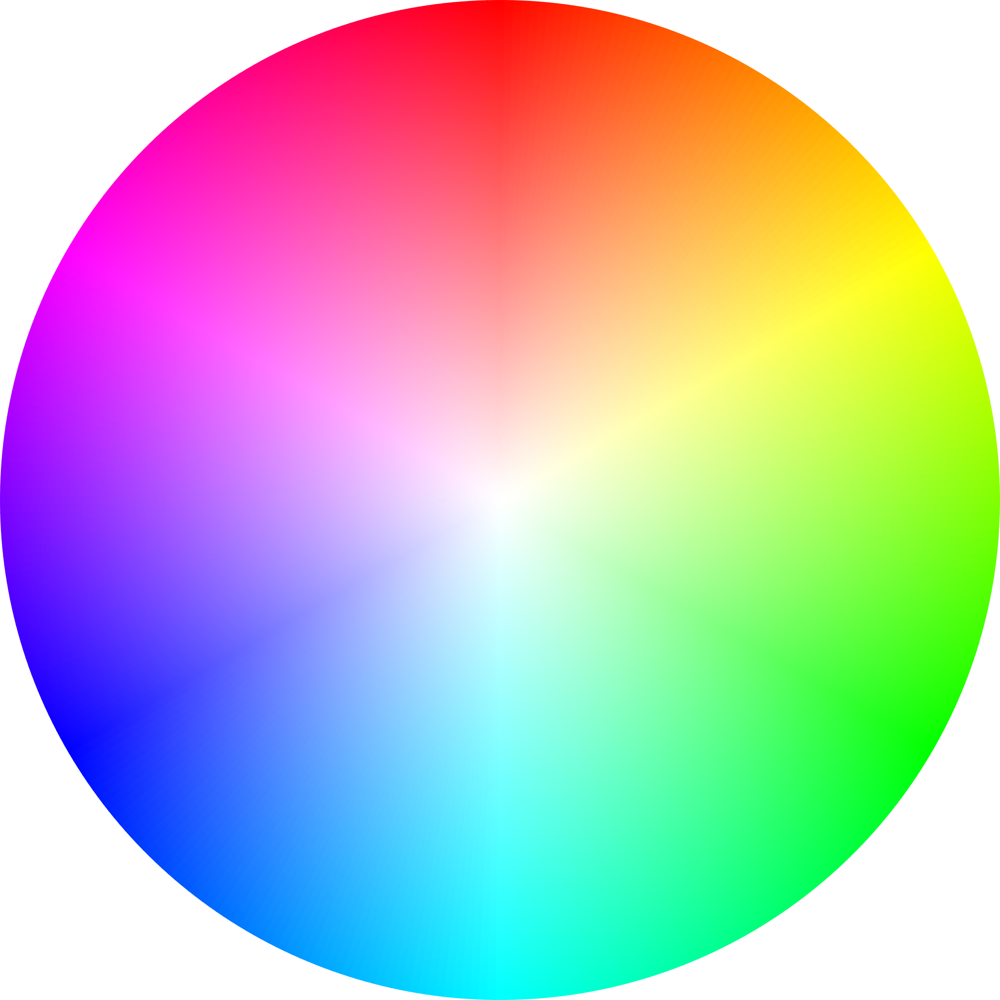

# asciimage

A Python program that converts images into ASCII representations, and vice versa.

# Demo

<p align="center">
  
  ,
</p>
along with <a href="https://github.com/agarnung/asciimage/blob/main/assets/circle_ascii.txt" target="_blank">its .txt colleague.</a>
<br></br>
<p align="center">
  
  ,
</p>
along with <a href="https://github.com/agarnung/asciimage/blob/main/assets/lena_ascii.txt" target="_blank">its .txt colleague.</a>

---

### Example of usage:

Clone the project:
```bash
git clone https://github.com/agarnung/asciimage.git
```

Install required dependencies (it is recommended tu use a virtual environment):
```bash
python3 -m pip install -r requirements.txt
```

Run the program in the root folder, e.g.:
```bash
python3 asciimage.py --file /home/alejandro/Pictures/lena.png --scale 0.43 --ascii_cols 100 --out ./results --font_color white --font_type times --symbols wasd123
```

Please refer to the program help:
```bash
python3 asciimage.py --help
```

---

### References:

- [GeeksforGeeks: Converting Image to ASCII Image in Python](https://www.geeksforgeeks.org/converting-image-ascii-image-python/)
- [ASCII Art Generator](https://dahtah.github.io/imager/ascii_art.html)
- [GitHub: Image to ASCII by ajratnam](https://github.com/ajratnam/image-to-ascii)

---

### Other consulted links:

- [Python aalib (kaiju)](https://github.com/kaiju/python-aalib/tree/master)
- [Python aalib (jwilk)](https://github.com/jwilk/python-aalib)

---

### TODO:

- Improve the resolution of the image formed from the text, with `scale=1`.
- Convert from ASCII to image by specifying the desired image size.

---
